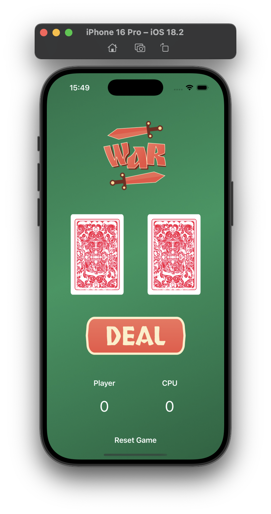
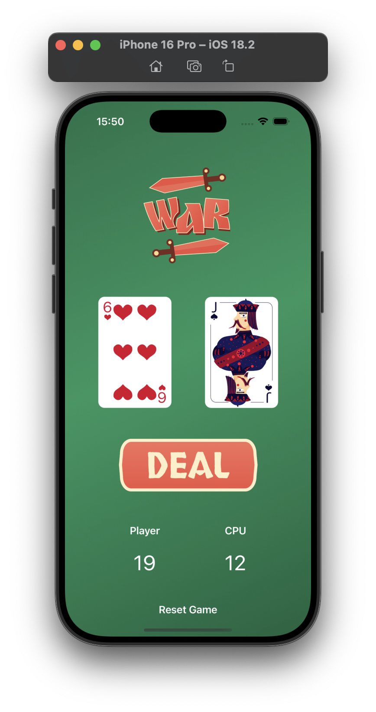

# War Card Game

<!-- Video and Screenshots Section -->

  <video width="320" height="240" controls>
    <source src="simulator_recording.mov" type="video/quicktime">
    Your browser does not support the video tag.
  </video>
  
  

## English

### Overview
War Card Game is a simple card game application built with SwiftUI. This is my first SwiftUI project, where I explored the fundamentals of Apple's declarative UI framework.

### Game Rules
- The player and the CPU each draw a random card
- The higher card wins a point
- In case of a tie, no points are awarded
- The game continues until the player decides to reset

### Features
- Clean and intuitive user interface
- Random card generation
- Score tracking for both player and CPU
- Reset functionality to start a new game
- Beautiful card animations

### Technical Details
- Built with SwiftUI
- Uses @State properties for reactive UI updates
- Implements random number generation for card values
- Custom assets for cards, background, and buttons

### How to Run
1. Clone the repository
2. Open the project in Xcode
3. Select a simulator or connect your iOS device
4. Build and run the application

### Future Improvements
- Add sound effects
- Implement game rounds
- Add difficulty levels
- Create a multiplayer mode

---

## Türkçe

### Genel Bakış
War Card Game (Savaş Kart Oyunu), SwiftUI ile oluşturulmuş basit bir kart oyunu uygulamasıdır. Bu, Apple'ın bildirimsel UI framework'ünün temellerini keşfettiğim ilk SwiftUI projemdir.

### Oyun Kuralları
- Oyuncu ve CPU her biri rastgele bir kart çeker
- Daha yüksek kart bir puan kazanır
- Beraberlik durumunda puan verilmez
- Oyuncu sıfırlama kararı verene kadar oyun devam eder

### Özellikler
- Temiz ve sezgisel kullanıcı arayüzü
- Rastgele kart üretimi
- Hem oyuncu hem de CPU için puan takibi
- Yeni bir oyun başlatmak için sıfırlama işlevi
- Güzel kart animasyonları

### Teknik Detaylar
- SwiftUI ile oluşturuldu
- Reaktif UI güncellemeleri için @State özellikleri kullanır
- Kart değerleri için rastgele sayı üretimi uygular
- Kartlar, arka plan ve düğmeler için özel varlıklar

### Nasıl Çalıştırılır
1. Depoyu klonlayın
2. Projeyi Xcode'da açın
3. Bir simülatör seçin veya iOS cihazınızı bağlayın
4. Uygulamayı derleyin ve çalıştırın

### Gelecek İyileştirmeler
- Ses efektleri ekleme
- Oyun turları uygulama
- Zorluk seviyeleri ekleme
- Çok oyunculu mod oluşturma 